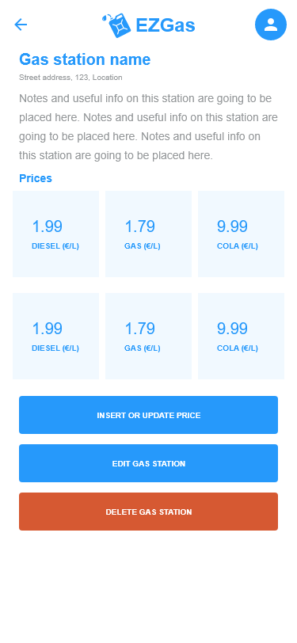

# Graphical User Interface Prototype  

Authors: Alberto Canta, Dario Licastro, Ignacio López-Perea, Luca Rinelli

Date: 17/04/2020

Version: 0.1

## Search and show stations and prices on map (FR3)

### Show gas stations in a specific radius from a specified location on map with their respective prices, put in evidence the cheapest, for the type of fuel selected by the user (FR3.1)
|   |
| :-: |

### Select a specific location on the map, including the possibility to use your current position, and define an area of interest for the search of gas stations providing a radius (FR3.2)

|  |
| :-: |

### Show a price ordered list of the cheapest gas stations for the given fuel type in the defined area of interest for the search of gas stations (FR3.3)

|  |
| :-: |

## Gas stations handling (FR1)

### Insert a new gas station in a specific position on the map (FR1.1)

|  |
| :-: |

### Update details for a gas station on the map (FR1.2)

|  |
| :-: |

### Show details for a specific gas station, delete a gas station from the map and show latest prices for each FuelType for a specific gas station (FR1.3, FR1.4 and FR2.2)

|  |
| :-: |

## Fuel prices handling (FR2)

### Insert prices for a specific fuel type in a gas station on the map (FR2.1)

|  |
| :-: |

## User related functionalities (FR4)

### Registered user log in (FR4.1)

|  |
| :-: |

### Registered user log out and user data edit (FR4.2 and FR4.5)

|  |
| :-: |

### Registation of new users (FR4.3)

|  |
| :-: |

## Account type definition and management, deactivation (FR5)

|  |
| :-: |

## Create report about content or application behavior for administrator (FR6)

|  |
| :-: |

|  |
| :-: |

## Show reports and assign report to an administrator (FR7 and FR8)

|  |
| :-: |