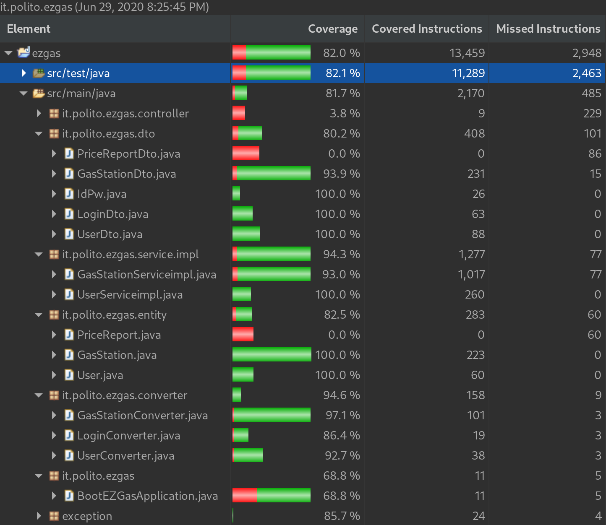

# Unit Testing Documentation

Authors: Luca Rinelli, Alberto Canta

Date: 18/05/2020

Version: 0

# Contents

- [Black Box Unit Tests](#black-box-unit-tests)

- [White Box Unit Tests](#white-box-unit-tests)

# Black Box Unit Tests

    <Define here criteria, predicates and the combination of predicates for each function of each class.
    Define test cases to cover all equivalence classes and boundary conditions.
    In the table, report the description of the black box test case and (traceability) the correspondence with the JUnit test case writing the
    class and method name that contains the test case>
    <JUnit test classes must be in src/test/java/it/polito/ezgas   You find here, and you can use,  class EZGasApplicationTests.java that is executed before
    the set up of all Spring components
    >

### Class *GasStation* - method *GasStation*

**Criteria for method *GasStation*:**

 - 

**Predicates for method *GasStation*:**

| Criteria | Predicate |
| -------- | --------- |
|  |  |
|          |  |

**Boundaries**:

| Criteria | Boundary values |
| -------- | --------------- |
|  |                 |

**Combination of predicates**:

| Criteria | Valid / Invalid | Description of the test case | JUnit test case |
| ------- | -------|-------|-------|
|  |  |  |testGasStationStringStringBooleanBooleanBooleanBooleanBooleanStringDoubleDoubleDoubleDoubleDoubleDoubleDoubleIntegerStringDouble() |

### Class *GasStation* - method *setGasStationId*

**Criteria for method *GasStation*:**

 - 

**Predicates for method *GasStation*:**

| Criteria | Predicate |
| -------- | --------- |
|  |  |
|          |  |

**Boundaries**:

| Criteria | Boundary values |
| -------- | --------------- |
|  |                 |

**Combination of predicates**:

| Criteria | Valid / Invalid | Description of the test case | JUnit test case |
| ------- | -------|-------|-------|
|  |  |  | testSetGetGasStationId() |
|  |  |  | testSetGetGasStationId1() |
|  |  |  | testSetGetGasStationId2() |

### Class *GasStation* - method *getGasStationId*

**Criteria for method *GasStation*:**

 - 

**Predicates for method *GasStation*:**

| Criteria | Predicate |
| -------- | --------- |
|  |  |
|          |  |

**Boundaries**:

| Criteria | Boundary values |
| -------- | --------------- |
|  |                 |

**Combination of predicates**:

| Criteria | Valid / Invalid | Description of the test case | JUnit test case |
| ------- | -------|-------|-------|
|  |  |  | testSetGetGasStationId |
|  |  |  | testSetGetGasStationId1() |
|  |  |  | testSetGetGasStationId2() |
|  |  |  | testGasStationStringStringBooleanBooleanBooleanBooleanBooleanStringDoubleDoubleDoubleDoubleDoubleDoubleDoubleIntegerStringDouble() |

### Class *GasStation* - method *setGasStationName*

**Criteria for method *GasStation*:**

 - 

**Predicates for method *GasStation*:**

| Criteria | Predicate |
| -------- | --------- |
|  |  |
|          |  |

**Boundaries**:

| Criteria | Boundary values |
| -------- | --------------- |
|  |                 |

**Combination of predicates**:

| Criteria | Valid / Invalid | Description of the test case | JUnit test case |
| ------- | -------|-------|-------|
|  |  |  | testSetGetGasStationName() |
|  |  |  | testSetGetGasStationName1() |
|  |  |  | testSetGetGasStationName2() |

### Class *GasStation* - method *getGasStationName*

**Criteria for method *GasStation*:**

 - 

**Predicates for method *GasStation*:**

| Criteria | Predicate |
| -------- | --------- |
|  |  |
|          |  |

**Boundaries**:

| Criteria | Boundary values |
| -------- | --------------- |
|  |                 |

**Combination of predicates**:

| Criteria | Valid / Invalid | Description of the test case | JUnit test case |
| ------- | -------|-------|-------|
|  |  |  | testSetGetGasStationName() |
|  |  |  | testSetGetGasStationName1() |
|  |  |  | testSetGetGasStationName2() |
|  |  |  | testGasStationStringStringBooleanBooleanBooleanBooleanBooleanStringDoubleDoubleDoubleDoubleDoubleDoubleDoubleIntegerStringDouble() |

### Class *GasStation* - method *setGasStationAddress*

**Criteria for method *GasStation*:**

 - 

**Predicates for method *GasStation*:**

| Criteria | Predicate |
| -------- | --------- |
|  |  |
|          |  |

**Boundaries**:

| Criteria | Boundary values |
| -------- | --------------- |
|  |                 |

**Combination of predicates**:

| Criteria | Valid / Invalid | Description of the test case | JUnit test case |
| ------- | -------|-------|-------|
|  |  |  | testSetGetGasStationAddress() |
|  |  |  | testSetGetGasStationAddress1() |
|  |  |  | testSetGetGasStationAddress2() |

### Class *GasStation* - method *getGasStationAddress*

**Criteria for method *GasStation*:**

 - 

**Predicates for method *GasStation*:**

| Criteria | Predicate |
| -------- | --------- |
|  |  |
|          |  |

**Boundaries**:

| Criteria | Boundary values |
| -------- | --------------- |
|  |                 |

**Combination of predicates**:

| Criteria | Valid / Invalid | Description of the test case | JUnit test case |
| ------- | -------|-------|-------|
|  |  |  | testSetGetGasStationAddress() |
|  |  |  | testSetGetGasStationAddress1() |
|  |  |  | testSetGetGasStationAddress2() |
|  |  |  | testGasStationStringStringBooleanBooleanBooleanBooleanBooleanStringDoubleDoubleDoubleDoubleDoubleDoubleDoubleIntegerStringDouble() |

### Class *GasStation* - method *setReportDependability*

**Criteria for method *GasStation*:**

 - 

**Predicates for method *GasStation*:**

| Criteria | Predicate |
| -------- | --------- |
|  |  |
|          |  |

**Boundaries**:

| Criteria | Boundary values |
| -------- | --------------- |
|  |                 |

**Combination of predicates**:

| Criteria | Valid / Invalid | Description of the test case | JUnit test case |
| ------- | -------|-------|-------|
|  |  |  | testSetGetReportDependability() |
|  |  |  | testSetGetReportDependability2() |

### Class *GasStation* - method *getReportDependability*

**Criteria for method *GasStation*:**

 - 

**Predicates for method *GasStation*:**

| Criteria | Predicate |
| -------- | --------- |
|  |  |
|          |  |

**Boundaries**:

| Criteria | Boundary values |
| -------- | --------------- |
|  |                 |

**Combination of predicates**:

| Criteria | Valid / Invalid | Description of the test case | JUnit test case |
| ------- | -------|-------|-------|
|  |  |  | testSetGetReportDependability() |
|  |  |  | testSetGetReportDependability2() |
|  |  |  | testGasStationStringStringBooleanBooleanBooleanBooleanBooleanStringDoubleDoubleDoubleDoubleDoubleDoubleDoubleIntegerStringDouble() |

### Class *GasStation* - method *setReportUser*

**Criteria for method *GasStation*:**

 - 

**Predicates for method *GasStation*:**

| Criteria | Predicate |
| -------- | --------- |
|  |  |
|          |  |

**Boundaries**:

| Criteria | Boundary values |
| -------- | --------------- |
|  |                 |

**Combination of predicates**:

| Criteria | Valid / Invalid | Description of the test case | JUnit test case |
| ------- | -------|-------|-------|
|  |  |  | testSetGetReportUser() |
|  |  |  | testSetGetReportUser2() |

### Class *GasStation* - method *getReportUser*

**Criteria for method *GasStation*:**

 - 

**Predicates for method *GasStation*:**

| Criteria | Predicate |
| -------- | --------- |
|  |  |
|          |  |

**Boundaries**:

| Criteria | Boundary values |
| -------- | --------------- |
|  |                 |

**Combination of predicates**:

| Criteria | Valid / Invalid | Description of the test case | JUnit test case |
| ------- | -------|-------|-------|
|  |  |  | testSetGetReportUser() |
|  |  |  | testSetGetReportUser2() |
|  |  |  | testGasStationStringStringBooleanBooleanBooleanBooleanBooleanStringDoubleDoubleDoubleDoubleDoubleDoubleDoubleIntegerStringDouble() |

### Class *GasStation* - method *setReportTimestamp*

**Criteria for method *GasStation*:**

 - 

**Predicates for method *GasStation*:**

| Criteria | Predicate |
| -------- | --------- |
|  |  |
|          |  |

**Boundaries**:

| Criteria | Boundary values |
| -------- | --------------- |
|  |                 |

**Combination of predicates**:

| Criteria | Valid / Invalid | Description of the test case | JUnit test case |
| ------- | -------|-------|-------|
|  |  |  | testSetGetReportTimestamp() |
|  |  |  | testSetGetReportTimestamp1() |
|  |  |  | testSetGetReportTimestamp2() |

### Class *GasStation* - method *getReportTimestamp*

**Criteria for method *GasStation*:**

 - 

**Predicates for method *GasStation*:**

| Criteria | Predicate |
| -------- | --------- |
|  |  |
|          |  |

**Boundaries**:

| Criteria | Boundary values |
| -------- | --------------- |
|  |                 |

**Combination of predicates**:

| Criteria | Valid / Invalid | Description of the test case | JUnit test case |
| ------- | -------|-------|-------|
|  |  |  | testSetGetReportTimestamp() |
|  |  |  | testSetGetReportTimestamp1() |
|  |  |  | testSetGetReportTimestamp2() |
|  |  |  | testGasStationStringStringBooleanBooleanBooleanBooleanBooleanStringDoubleDoubleDoubleDoubleDoubleDoubleDoubleIntegerStringDouble() |

### Class *GasStation* - method *setUser*

**Criteria for method *GasStation*:**

 - 

**Predicates for method *GasStation*:**

| Criteria | Predicate |
| -------- | --------- |
|  |  |
|          |  |

**Boundaries**:

| Criteria | Boundary values |
| -------- | --------------- |
|  |                 |

**Combination of predicates**:

| Criteria | Valid / Invalid | Description of the test case | JUnit test case |
| ------- | -------|-------|-------|
|  |  |  | testSetGetUser() |

### Class *GasStation* - method *getUser*

**Criteria for method *GasStation*:**

 - 

**Predicates for method *GasStation*:**

| Criteria | Predicate |
| -------- | --------- |
|  |  |
|          |  |

**Boundaries**:

| Criteria | Boundary values |
| -------- | --------------- |
|  |                 |

**Combination of predicates**:

| Criteria | Valid / Invalid | Description of the test case | JUnit test case |
| ------- | -------|-------|-------|
|  |  |  | testSetGetUser() |

### Class *GasStation* - method *setCarSharing*

**Criteria for method *GasStation*:**

 - 

**Predicates for method *GasStation*:**

| Criteria | Predicate |
| -------- | --------- |
|  |  |
|          |  |

**Boundaries**:

| Criteria | Boundary values |
| -------- | --------------- |
|  |                 |

**Combination of predicates**:

| Criteria | Valid / Invalid | Description of the test case | JUnit test case |
| ------- | -------|-------|-------|
|  |  |  | testSetGetCarSharing() |
|  |  |  | testSetGetCarSharing2() |

### Class *GasStation* - method *getCarSharing*

**Criteria for method *GasStation*:**

 - 

**Predicates for method *GasStation*:**

| Criteria | Predicate |
| -------- | --------- |
|  |  |
|          |  |

**Boundaries**:

| Criteria | Boundary values |
| -------- | --------------- |
|  |                 |

**Combination of predicates**:

| Criteria | Valid / Invalid | Description of the test case | JUnit test case |
| ------- | -------|-------|-------|
|  |  |  | testSetGetCarSharing() |
|  |  |  | testSetGetCarSharing2() |
|  |  |  | testGasStationStringStringBooleanBooleanBooleanBooleanBooleanStringDoubleDoubleDoubleDoubleDoubleDoubleDoubleIntegerStringDouble() |

### Class *GasStation* - method *setLat*

**Criteria for method *GasStation*:**

 - 

**Predicates for method *GasStation*:**

| Criteria | Predicate |
| -------- | --------- |
|  |  |
|          |  |

**Boundaries**:

| Criteria | Boundary values |
| -------- | --------------- |
|  |                 |

**Combination of predicates**:

| Criteria | Valid / Invalid | Description of the test case | JUnit test case |
| ------- | -------|-------|-------|
|  |  |  | testSetGetLat() |
|  |  |  | testSetGetLat2() |

### Class *GasStation* - method *getLat*

**Criteria for method *GasStation*:**

 - 

**Predicates for method *GasStation*:**

| Criteria | Predicate |
| -------- | --------- |
|  |  |
|          |  |

**Boundaries**:

| Criteria | Boundary values |
| -------- | --------------- |
|  |                 |

**Combination of predicates**:

| Criteria | Valid / Invalid | Description of the test case | JUnit test case |
| ------- | -------|-------|-------|
|  |  |  | testSetGetLat() |
|  |  |  | testSetGetLat2() |
|  |  |  | testGasStationStringStringBooleanBooleanBooleanBooleanBooleanStringDoubleDoubleDoubleDoubleDoubleDoubleDoubleIntegerStringDouble() |

### Class *GasStation* - method *setLon*

**Criteria for method *GasStation*:**

 - 

**Predicates for method *GasStation*:**

| Criteria | Predicate |
| -------- | --------- |
|  |  |
|          |  |

**Boundaries**:

| Criteria | Boundary values |
| -------- | --------------- |
|  |                 |

**Combination of predicates**:

| Criteria | Valid / Invalid | Description of the test case | JUnit test case |
| ------- | -------|-------|-------|
|  |  |  | testSetGetLon() |
|  |  |  | testSetGetLon2() |

### Class *GasStation* - method *getLon*

**Criteria for method *GasStation*:**

 - 

**Predicates for method *GasStation*:**

| Criteria | Predicate |
| -------- | --------- |
|  |  |
|          |  |

**Boundaries**:

| Criteria | Boundary values |
| -------- | --------------- |
|  |                 |

**Combination of predicates**:

| Criteria | Valid / Invalid | Description of the test case | JUnit test case |
| ------- | -------|-------|-------|
|  |  |  | testSetGetLon() |
|  |  |  | testSetGetLon2() |
|  |  |  | testGasStationStringStringBooleanBooleanBooleanBooleanBooleanStringDoubleDoubleDoubleDoubleDoubleDoubleDoubleIntegerStringDouble() |

### Class *GasStation* - method *setHas...*

**Criteria for method *GasStation*:**

 - 

**Predicates for method *GasStation*:**

| Criteria | Predicate |
| -------- | --------- |
|  |  |
|          |  |

**Boundaries**:

| Criteria | Boundary values |
| -------- | --------------- |
|  |                 |

**Combination of predicates**:

| Criteria | Valid / Invalid | Description of the test case | JUnit test case |
| ------- | -------|-------|-------|
|  |  |  | testSetGetHasDiesel() |
|  |  |  | testSetGetHasSuper() |
|  |  |  | testSetGetHasSuperPlus() |
|  |  |  | testSetGetHasGas() |
|  |  |  | testSetGetHasMethane() |
|  |  |  | testSetGetHasDiesel2() |
|  |  |  | testSetGetHasSuper2() |
|  |  |  | testSetGetHasSuperPlus2() |
|  |  |  | testSetGetHasGas2() |
|  |  |  | testSetGetHasMethane2() |

### Class *GasStation* - method *getHas...*

**Criteria for method *GasStation*:**

 - 

**Predicates for method *GasStation*:**

| Criteria | Predicate |
| -------- | --------- |
|  |  |
|          |  |

**Boundaries**:

| Criteria | Boundary values |
| -------- | --------------- |
|  |                 |

**Combination of predicates**:

| Criteria | Valid / Invalid | Description of the test case | JUnit test case |
| ------- | -------|-------|-------|
|  |  |  | testSetGetHasDiesel() |
|  |  |  | testSetGetHasSuper() |
|  |  |  | testSetGetHasSuperPlus() |
|  |  |  | testSetGetHasGas() |
|  |  |  | testSetGetHasMethane() |
|  |  |  | testSetGetHasDiesel2() |
|  |  |  | testSetGetHasSuper2() |
|  |  |  | testSetGetHasSuperPlus2() |
|  |  |  | testSetGetHasGas2() |
|  |  |  | testSetGetHasMethane2() |
|  |  |  | testGasStationStringStringBooleanBooleanBooleanBooleanBooleanStringDoubleDoubleDoubleDoubleDoubleDoubleDoubleIntegerStringDouble() |

### Class *GasStation* - method *set...Price*

**Criteria for method *GasStation*:**

 - 

**Predicates for method *GasStation*:**

| Criteria | Predicate |
| -------- | --------- |
|  |  |
|          |  |

**Boundaries**:

| Criteria | Boundary values |
| -------- | --------------- |
|  |                 |

**Combination of predicates**:

| Criteria | Valid / Invalid | Description of the test case | JUnit test case |
| ------- | -------|-------|-------|
|  |  |  | testSetGetDieselPrice() |
|  |  |  | testSetGetSuperPrice() |
|  |  |  | testSetGetSuperPlusPrice() |
|  |  |  | testSetGetGasPrice() |
|  |  |  | testSetGetMethanePrice() |
|  |  |  | testSetGetDieselPrice2() |
|  |  |  | testSetGetSuperPrice2() |
|  |  |  | testSetGetSuperPlusPrice2() |
|  |  |  | testSetGetGasPrice2() |
|  |  |  | testSetGetMethanePrice2() |

### Class *GasStation* - method *get...Price*

**Criteria for method *GasStation*:**

 - 

**Predicates for method *GasStation*:**

| Criteria | Predicate |
| -------- | --------- |
|  |  |
|          |  |

**Boundaries**:

| Criteria | Boundary values |
| -------- | --------------- |
|  |                 |

**Combination of predicates**:

| Criteria | Valid / Invalid | Description of the test case | JUnit test case |
| ------- | -------|-------|-------|
|  |  |  | testSetGetDieselPrice() |
|  |  |  | testSetGetSuperPrice() |
|  |  |  | testSetGetSuperPlusPrice() |
|  |  |  | testSetGetGasPrice() |
|  |  |  | testSetGetMethanePrice() |
|  |  |  | testSetGetDieselPrice2() |
|  |  |  | testSetGetSuperPrice2() |
|  |  |  | testSetGetSuperPlusPrice2() |
|  |  |  | testSetGetGasPrice2() |
|  |  |  | testSetGetMethanePrice2() |
|  |  |  | testGasStationStringStringBooleanBooleanBooleanBooleanBooleanStringDoubleDoubleDoubleDoubleDoubleDoubleDoubleIntegerStringDouble() |

### Class *GasStationServiceimpl* - method *getGasStationById*

Queries the database and return a single gas station corresponding to the database given as parameter.

Returns null if no gas station is found with the given id.

**Criteria for method *getGasStationById*:**

 - Value of gasStationId

**Predicates for method *getGasStationById*:**

| Criteria | Predicate |
| -------- | --------- |
| Value of gasStationId | a gas station with this gasStationId is present in the database |
|          | no gas station in the database for this gasStationId |

**Boundaries**:

| Criteria | Boundary values |
| -------- | --------------- |
|  |                 |

**Combination of predicates**:

| Value of gasStationId | Valid / Invalid | Description of the test case | JUnit test case |
| ------- | -------|-------|-------|
| Is in the db | Yes | Retrieve correctly a gas station present in the db by its id | testGetGasStationById() |
| Is not in the db | Yes | No gas station for this id in the db, the function should return null | testGetGasStationByIdAbsent() |

### Class *GasStationServiceimpl* - method *saveGasStation*

Receives a GasStationDto and store it in the database.

Throws exceptions in case of negative prices or wrong latitude and longitude values in the GasStationDto.

**Criteria for method *saveGasStation*:**

 - Value of prices
 - Value latitude
 - Value longitude
 - existing gas station

**Predicates for method *saveGasStation*:**

| Criteria | Predicate |
| -------- | --------- |
| Value of prices | no price is negative |
|          | at least one price is negative |
| Value latitude | correct [-90, +90] |
|          | wrong (-inf, -90) U (+90, +inf) |
| Value longitude | correct [-180, +180] |
|          | wrong (-inf, -180) U (+180, +inf) |
| existing gas station | yes |
|          | no |

**Boundaries**:

| Criteria | Boundary values |
| -------- | --------------- |
| Value of prices | price equal to 0 |
| Value latitude | -90 |
|          | +90 |
| Value longitude | -180 |
|          | +180 |

**Combination of predicates**

| Existing gas station | Value of prices | Value latitude | Value longitude | Valid / Invalid | Description of the test case | JUnit test case |
| --- | --- | --- | --- | --- | --- | --- |
| no | no negative | correct | correct | Yes | Correct insertion, no exception should be generated | testSaveGasStation1() |
| no | no negative | correct | wrong | Yes | Correct price. Wrong longitude, an exception for GPS should be generated | testSaveGasStation3() |
| no | no negative | wrong | correct | Yes | Correct price. Wrong latitude, an exception for GPS should be generated | testSaveGasStation4() |
| no | no negative | wrong | wrong | Yes | Correct price. Wrong longitude and latitude, an exception for GPS should be generated | skipped |
| no | at least one negative | correct | correct | Yes | Correct GPS. Negative price, an exception for price must be generated | testSaveGasStation2() |
| no | at least one negative | correct | wrong | Yes | Wrong prices and GPS, an exception for one of the two error must be generated | skipped |
| no | at least one negative | wrong | correct | Yes | Wrong prices and GPS, an exception for one of the two error must be generated | skipped |
| no | at least one negative | wrong | wrong | Yes | Wrong prices and GPS, an exception for one of the two error must be generated | testSaveGasStation5() |
| yes | no negative | correct | correct | Yes | Existing gas station. Correct insertion, no exception should be generated | testSaveGasStation6() |
| yes | no negative | correct | wrong | Yes | Existing gas station. Correct price. Wrong longitude, an exception for GPS should be generated |  |
| yes | no negative | wrong | correct | Yes | Existing gas station. Correct price. Wrong latitude, an exception for GPS should be generated |  |
| yes | no negative | wrong | wrong | Yes | Existing gas station. Correct price. Wrong longitude and latitude, an exception for GPS should be generated |  |
| yes | at least one negative | correct | correct | Yes | Existing gas station. Correct GPS. Negative price, an exception for price must be generated |  |
| yes | at least one negative | correct | wrong | Yes | Existing gas station. Wrong prices and GPS, an exception for one of the two error must be generated |  |
| yes | at least one negative | wrong | correct | Yes | Existing gas station. Wrong prices and GPS, an exception for one of the two error must be generated |  |
| yes | at least one negative | wrong | wrong | Yes | Existing gas station. Wrong prices and GPS, an exception for one of the two error must be generated |  |

### Class *GasStationServiceimpl* - method *getAllGasStations*

Returns an ArrayList with all the GasStations stored in the database

Returns an empty ArrayList if no gas station is registered in the database

**Criteria for method *getAllGasStations*:**

 - Number of gas stations in db

**Predicates for method *getAllGasStations*:**

| Criteria | Predicate |
| -------- | --------- |
| Number of gas stations in db | no gas station in the db |
|          | one gas station in the db |
|          | many gas station in the db |

**Boundaries**:

| Criteria | Boundary values |
| -------- | --------------- |
|  |  |

**Combination of predicates**

| Number of gas stations in db | Valid / Invalid | Description of the test case | JUnit test case |
| --- | --- | --- | --- |
| no gas station in the db | Yes | No gas station in db, empty list | testGetAllGasStationsNone() |
| one gas station in the db | Yes | One gas station, list one element | skipped |
| many gas station in the db | Yes | Multiple gas stations in db, list returned | testGetAllGasStations() |

### Class *GasStationServiceimpl* - method *deleteGasStation*

Deletes from the database the GasStation with the id passed as parameter. Throws an exception in case of invalid id (<0).

Returns null in case of not found gas station

**Criteria for method *deleteGasStation*:**

 - Value of gasStationId

**Predicates for method *deleteGasStation*:**

| Criteria | Predicate |
| -------- | --------- |
| Value of gasStationId | a gas station with this gasStationId is present in the database |
|          | no gas station in the database for this gasStationId |
|          | Invalid id (less than 0) |

**Boundaries**:

| Criteria | Boundary values |
| -------- | --------------- |
|  |  |

**Combination of predicates**

| Value of gasStationId | Valid / Invalid | Description of the test case | JUnit test case |
| ------- | -------|-------|-------|
| Is in the db | Yes | Delete the corresponding gas station from the db, no exception. | testDeleteGasStation() |
| Is not in the db | Yes | No gas station for this id in the db, the function should return null | testDeleteGasStationAbsent() |
| Less than 0 | Yes | Throws an InvalidGasStationException exception | testDeleteGasStationInvalid() |

### Class *GasStationServiceimpl* - method *getGasStationsByGasolineType*

Returns all gas stations that provide the gasoline type provided as parameter, sorted by increasing price of that gasoline type.

Returns an empty ArrayList if no gas station in the database provides the given gasoline type

Throws an exception if an invalid gasoline type is given as parameter

**Criteria for method *getGasStationsByGasolineType*:**

 - String gasolinetype

**Predicates for method *getGasStationsByGasolineType*:**

| Criteria | Predicate |
| -------- | --------- |
| String gasolinetype | valid, gas stations exists with this type in the db |
|          | valid, NO gas stations exists with this type in the db |
|          | invalid |

**Boundaries**:

| Criteria | Boundary values |
| -------- | --------------- |
|  |  |

**Combination of predicates**

| String gasolinetype | Valid / Invalid | Description of the test case | JUnit test case |
| --- | -------|-------|-------|
| valid, gas stations exists with this type in the db | Yes | Returns all gas stations that provide the gasoline type provided as parameter, SORTED by increasing price of that gasoline type | Tested in integration |
| valid, NO gas stations exists with this type in the db | Yes | Returns an empty ArrayList | Tested in integration |
| invalid | Yes | Throws an InvalidGasTypeException | testGetGasStationsByGasolineTypeInvalid() |

### Class *GasStationServiceimpl* - method *getGasStationsByProximity*

Returns all gas stations within 1km from the GeoPoint whose latitude and longitude are passed as parameters.

Returns an empty ArrayList if no gas station in the database is located within 1km from that geopoint

Throws an exception if an invalid value is given for latitude and/or longitude

**Criteria for method *getGasStationsByProximity*:**

 - Value latitude
 - Value longitude
 - Gas stations positions

**Predicates for method *getGasStationsByProximity*:**

| Criteria | Predicate |
| -------- | --------- |
| Value latitude | correct [-90, +90] |
|          | wrong (-inf, -90) U (+90, +inf) |
| Value longitude | correct [-180, +180] |
|          | wrong (-inf, -180) U (+180, +inf) |
| Gas stations positions | gas stations are present in a range of 1km from given coordinates |
|          | gas stations exists but are not in a range of 1km from given coordinates |

**Boundaries**:

| Criteria | Boundary values |
| -------- | --------------- |
|  |  |

**Combination of predicates**

| Value latitude | Value longitude | Gas stations positions | Valid / Invalid | Description of the test case | JUnit test case |
| --- | --- | --- | --- | --- | --- |
| correct [-90, +90] | correct [-180, +180] | gas stations are present in a range of 1km from given coordinates | Yes | Correct input, gas stations exists in range. Returns all gas stations within 1km from the GeoPoint whose latitude and longitude are passed as parameters. **Specific order?** | Tested in integration |
| correct [-90, +90] | correct [-180, +180] | gas stations exists but are not in a range of 1km from given coordinates | Yes | Correct input, **NO** gas stations exists in range. Returns an empty ArrayList. | Tested in integration |
| correct [-90, +90] | wrong (-inf, -180) U (+180, +inf) | gas stations are present in a range of 1km from given coordinates | Yes | Wrong input longitude, throws GPSDataException. | testGetGasStationsByProximityWrongLon()  |
| correct [-90, +90] | wrong (-inf, -180) U (+180, +inf) | gas stations exists but are not in a range of 1km from given coordinates | Skipped |  |   |
| wrong (-inf, -90) U (+90, +inf) | correct [-180, +180] | gas stations are present in a range of 1km from given coordinates | Yes | Wrong input latitude, throws GPSDataException. | testGetGasStationsByProximityWrongLat() |
| wrong (-inf, -90) U (+90, +inf) | correct [-180, +180] | gas stations exists but are not in a range of 1km from given coordinates | Skipped |  |  |
| wrong (-inf, -90) U (+90, +inf) | wrong (-inf, -180) U (+180, +inf) | gas stations are present in a range of 1km from given coordinates | Yes | Wrong input latitude and longitude, throws GPSDataException. | testGetGasStationsByProximityWrongLonLat() |
| wrong (-inf, -90) U (+90, +inf) | wrong (-inf, -180) U (+180, +inf) | gas stations exists but are not in a range of 1km from given coordinates | Skipped |  |  |

### Class *GasStationServiceimpl* - method *getGasStationsWithCoordinates*

Returns all gas stations within 1km from the GeoPoint whose latitude and longitude are passed as parameters.

It receives as parameters a gasolinetype and a carsharing value.

If gasolinetype is different than "null" (string), it filters the list of gas stations keeping only those providing such gasoline type

If carsharing is different than "null" (string), it filters the list of gas stations keeping only those affiliated to that carsharing company

Returns an empty ArrayList if no gas station is found in the database with the given parameters

Throws an exception if an invalid value is given for latitude and/or longitude, gasolinetype or carsharing string parameters

**Criteria for method *getGasStationsWithCoordinates*:**

 - Value latitude
 - Value longitude
 - Gas stations positions
 - String gasolinetype
 - String carsharing

**Predicates for method *getGasStationsWithCoordinates*:**

| Criteria | Predicate |
| -------- | --------- |
| Value latitude | correct [-90, +90] |
|          | wrong (-inf, -90) U (+90, +inf) |
| Value longitude | correct [-180, +180] |
|          | wrong (-inf, -180) U (+180, +inf) |
| Gas stations positions | gas stations are present in a range of 1km from given coordinates |
|          | gas stations exists but are not in a range of 1km from given coordinates |
| gasolinetype | null |
|  | valid |
|  | invalid |
| carsharing | null |
|  | valid |

**Boundaries**:

| Criteria | Boundary values |
| -------- | --------------- |
|  |  |

**Combination of predicates**

| gasolinetype | carsharing | Value latitude | Value longitude | Gas stations positions | Valid / Invalid | Description of the test case | JUnit test case |
| --- | --- | --- | --- | --- | --- | --- | --- |
| null | null | correct [-90, +90] | correct [-180, +180] | gas stations are present in a range of 1km from given coordinates | Yes | Correct input, gas stations exists in range. Returns all gas stations within 1km from the GeoPoint whose latitude and longitude are passed as parameters. **Specific order?** |  |
| null | null | correct [-90, +90] | correct [-180, +180] | gas stations exists but are not in a range of 1km from given coordinates | Yes | Correct input, **NO** gas stations exists in range. Returns an empty ArrayList. |  |
| null | null | correct [-90, +90] | wrong (-inf, -180) U (+180, +inf) | gas stations are present in a range of 1km from given coordinates | Yes | Wrong input longitude, throws GPSDataException. |  |
| null | null | correct [-90, +90] | wrong (-inf, -180) U (+180, +inf) | gas stations exists but are not in a range of 1km from given coordinates | Skipped |  |  |
| null | null | wrong (-inf, -90) U (+90, +inf) | correct [-180, +180] | gas stations are present in a range of 1km from given coordinates | Yes | Wrong input latitude, throws GPSDataException. |  |
| null | null | wrong (-inf, -90) U (+90, +inf) | correct [-180, +180] | gas stations exists but are not in a range of 1km from given coordinates | Skipped |  |  |
| null | null | wrong (-inf, -90) U (+90, +inf) | wrong (-inf, -180) U (+180, +inf) | gas stations are present in a range of 1km from given coordinates | Yes | Wrong input latitude and longitude, throws GPSDataException. |  |
| null | null | wrong (-inf, -90) U (+90, +inf) | wrong (-inf, -180) U (+180, +inf) | gas stations exists but are not in a range of 1km from given coordinates | Skipped |  |  |
| null | valid | correct [-90, +90] | correct [-180, +180] | gas stations are present in a range of 1km from given coordinates | Yes | Correct input, gas stations exists in range. Returns all gas stations within 1km from the GeoPoint whose latitude and longitude are passed as parameters. **Specific order?** |  |
| null | valid | correct [-90, +90] | correct [-180, +180] | gas stations exists but are not in a range of 1km from given coordinates | Yes | Correct input, **NO** gas stations exists in range. Returns an empty ArrayList. |  |
| null | valid | correct [-90, +90] | wrong (-inf, -180) U (+180, +inf) | gas stations are present in a range of 1km from given coordinates | Yes | Wrong input longitude, throws GPSDataException. |  |
| null | valid | correct [-90, +90] | wrong (-inf, -180) U (+180, +inf) | gas stations exists but are not in a range of 1km from given coordinates | Skipped |  |  |
| null | valid | wrong (-inf, -90) U (+90, +inf) | correct [-180, +180] | gas stations are present in a range of 1km from given coordinates | Yes | Wrong input latitude, throws GPSDataException. |  |
| null | valid | wrong (-inf, -90) U (+90, +inf) | correct [-180, +180] | gas stations exists but are not in a range of 1km from given coordinates | Skipped |  |  |
| null | valid | wrong (-inf, -90) U (+90, +inf) | wrong (-inf, -180) U (+180, +inf) | gas stations are present in a range of 1km from given coordinates | Yes | Wrong input latitude and longitude, throws GPSDataException. |  |
| null | valid | wrong (-inf, -90) U (+90, +inf) | wrong (-inf, -180) U (+180, +inf) | gas stations exists but are not in a range of 1km from given coordinates | Skipped |  |  |
| valid | null | correct [-90, +90] | correct [-180, +180] | gas stations are present in a range of 1km from given coordinates | Yes | Correct input, gas stations exists in range. Returns all gas stations within 1km from the GeoPoint whose latitude and longitude are passed as parameters. **Specific order?** |  |
| valid | null | correct [-90, +90] | correct [-180, +180] | gas stations exists but are not in a range of 1km from given coordinates | Yes | Correct input, **NO** gas stations exists in range. Returns an empty ArrayList. |  |
| valid | null | correct [-90, +90] | wrong (-inf, -180) U (+180, +inf) | gas stations are present in a range of 1km from given coordinates | Yes | Wrong input longitude, throws GPSDataException. |  |
| valid | null | correct [-90, +90] | wrong (-inf, -180) U (+180, +inf) | gas stations exists but are not in a range of 1km from given coordinates | Skipped |  |  |
| valid | null | wrong (-inf, -90) U (+90, +inf) | correct [-180, +180] | gas stations are present in a range of 1km from given coordinates | Yes | Wrong input latitude, throws GPSDataException. |  |
| valid | null | wrong (-inf, -90) U (+90, +inf) | correct [-180, +180] | gas stations exists but are not in a range of 1km from given coordinates | Skipped |  |  |
| valid | null | wrong (-inf, -90) U (+90, +inf) | wrong (-inf, -180) U (+180, +inf) | gas stations are present in a range of 1km from given coordinates | Yes | Wrong input latitude and longitude, throws GPSDataException. |  |
| valid | null | wrong (-inf, -90) U (+90, +inf) | wrong (-inf, -180) U (+180, +inf) | gas stations exists but are not in a range of 1km from given coordinates | Skipped |  |  |
| valid | valid | correct [-90, +90] | correct [-180, +180] | gas stations are present in a range of 1km from given coordinates | Yes | Correct input, gas stations exists in range. Returns all gas stations within 1km from the GeoPoint whose latitude and longitude are passed as parameters. **Specific order?** |  |
| valid | valid | correct [-90, +90] | correct [-180, +180] | gas stations exists but are not in a range of 1km from given coordinates | Yes | Correct input, **NO** gas stations exists in range. Returns an empty ArrayList. |  |
| valid | valid | correct [-90, +90] | wrong (-inf, -180) U (+180, +inf) | gas stations are present in a range of 1km from given coordinates | Yes | Wrong input longitude, throws GPSDataException. |  |
| valid | valid | correct [-90, +90] | wrong (-inf, -180) U (+180, +inf) | gas stations exists but are not in a range of 1km from given coordinates | Skipped |  |  |
| valid | valid | wrong (-inf, -90) U (+90, +inf) | correct [-180, +180] | gas stations are present in a range of 1km from given coordinates | Yes | Wrong input latitude, throws GPSDataException. |  |
| valid | valid | wrong (-inf, -90) U (+90, +inf) | correct [-180, +180] | gas stations exists but are not in a range of 1km from given coordinates | Skipped |  |  |
| valid | valid | wrong (-inf, -90) U (+90, +inf) | wrong (-inf, -180) U (+180, +inf) | gas stations are present in a range of 1km from given coordinates | Yes | Wrong input latitude and longitude, throws GPSDataException. |  |
| valid | valid | wrong (-inf, -90) U (+90, +inf) | wrong (-inf, -180) U (+180, +inf) | gas stations exists but are not in a range of 1km from given coordinates | Skipped |  |  |
| invalid | null | correct [-90, +90] | correct [-180, +180] | gas stations are present in a range of 1km from given coordinates | Yes | Correct input, gas stations exists in range. Returns all gas stations within 1km from the GeoPoint whose latitude and longitude are passed as parameters. **Specific order?** |  |
| invalid | null | correct [-90, +90] | correct [-180, +180] | gas stations exists but are not in a range of 1km from given coordinates | Yes | Correct input, **NO** gas stations exists in range. Returns an empty ArrayList. |  |
| invalid | null | correct [-90, +90] | wrong (-inf, -180) U (+180, +inf) | gas stations are present in a range of 1km from given coordinates | Yes | Wrong input longitude, throws GPSDataException. |  |
| invalid | null | correct [-90, +90] | wrong (-inf, -180) U (+180, +inf) | gas stations exists but are not in a range of 1km from given coordinates | Skipped |  |  |
| invalid | null | wrong (-inf, -90) U (+90, +inf) | correct [-180, +180] | gas stations are present in a range of 1km from given coordinates | Yes | Wrong input latitude, throws GPSDataException. |  |
| invalid | null | wrong (-inf, -90) U (+90, +inf) | correct [-180, +180] | gas stations exists but are not in a range of 1km from given coordinates | Skipped |  |  |
| invalid | null | wrong (-inf, -90) U (+90, +inf) | wrong (-inf, -180) U (+180, +inf) | gas stations are present in a range of 1km from given coordinates | Yes | Wrong input latitude and longitude, throws GPSDataException. |  |
| invalid | null | wrong (-inf, -90) U (+90, +inf) | wrong (-inf, -180) U (+180, +inf) | gas stations exists but are not in a range of 1km from given coordinates | Skipped |  |  |
| invalid | valid | correct [-90, +90] | correct [-180, +180] | gas stations are present in a range of 1km from given coordinates | Yes | Correct input, gas stations exists in range. Returns all gas stations within 1km from the GeoPoint whose latitude and longitude are passed as parameters. **Specific order?** |  |
| invalid | valid | correct [-90, +90] | correct [-180, +180] | gas stations exists but are not in a range of 1km from given coordinates | Yes | Correct input, **NO** gas stations exists in range. Returns an empty ArrayList. |  |
| invalid | valid | correct [-90, +90] | wrong (-inf, -180) U (+180, +inf) | gas stations are present in a range of 1km from given coordinates | Yes | Wrong input longitude, throws GPSDataException. |  |
| invalid | valid | correct [-90, +90] | wrong (-inf, -180) U (+180, +inf) | gas stations exists but are not in a range of 1km from given coordinates | Skipped |  |  |
| invalid | valid | wrong (-inf, -90) U (+90, +inf) | correct [-180, +180] | gas stations are present in a range of 1km from given coordinates | Yes | Wrong input latitude, throws GPSDataException. |  |
| invalid | valid | wrong (-inf, -90) U (+90, +inf) | correct [-180, +180] | gas stations exists but are not in a range of 1km from given coordinates | Skipped |  |  |
| invalid | valid | wrong (-inf, -90) U (+90, +inf) | wrong (-inf, -180) U (+180, +inf) | gas stations are present in a range of 1km from given coordinates | Yes | Wrong input latitude and longitude, throws GPSDataException. |  |
| invalid | valid | wrong (-inf, -90) U (+90, +inf) | wrong (-inf, -180) U (+180, +inf) | gas stations exists but are not in a range of 1km from given coordinates | Skipped |  |  |

### Class *GasStationServiceimpl* - method *getGasStationsByCarSharing*

Returns all gas stations within 1km from the GeoPoint whose latitude and longitude are passed as parameters.

Returns an empty ArrayList if no gas station in the database is located within 1km from that geopoint

Throws an exception if an invalid value is given for latitude and/or longitude

**Criteria for method *getGasStationsByCarSharing*:**

 - String carSharing

**Predicates for method *getGasStationsByCarSharing*:**

| Criteria | Predicate |
| -------- | --------- |
| String carSharing | gas stations exists with this type in the db |
|          | NO gas stations exists with this type in the db |

**Boundaries**:

| Criteria | Boundary values |
| -------- | --------------- |
|  |  |

**Combination of predicates**

| carsharing | Valid / Invalid | Description of the test case | JUnit test case |
| --- | -------|-------|-------|
| exists, gas stations exists with this type in the db | Yes | Returns all gas stations that provide the gasoline type provided as parameter, SORTED by increasing price of that gasoline type | Tested in integration |
| NO gas stations exists with this type in the db | Yes | Returns an empty ArrayList | Tested in integration |

### [WIP] Class *GasStationServiceimpl* - method *getGasStationsWithoutCoordinates*

Returns all gas stations of a car sharing and having one specific gasoline type.

It receives as parameters a gasolinetype and a carsharing value.

If gasolinetype is different than "null" (string), it filters the list of gas stations keeping only those providing such gasoline type.

If carsharing is different than "null" (string), it filters the list of gas stations, previously filtered by gasolinetype, keeping only those affiliated to that carsharing company.

Returns an empty ArrayList if no gas station is found in the database with the given parameters.

Throws an exception if an invalid value is given for gasolinetype or carsharing string parameters.

**Criteria for method *getGasStationsWithoutCoordinates*:**

 - String gasolinetype
 - String carsharing

**Predicates for method *getGasStationsWithoutCoordinates*:**

| Criteria | Predicate |
| -------- | --------- |
| String gasolinetype | valid, gas stations exists with this type in the db |
|          | invalid, NO gas stations exists with this type in the db |
| String carsharing | valid, alfanumeric words |
|          | invalid, null |

**Boundaries**:

| Criteria | Boundary values |
| -------- | --------------- |
|  |  |

**Combination of predicates**

| String gasolinetype | String carsharing  | Valid / Invalid | Description of the test case | JUnit test case |
| --- | --- | --- | --- | --- | --- |
| correct  | correct |  Yes | Correct input, gas stations exists in range. Returns all gas stations with right car sharing company and gasoline type whose car sharing company and gasoline type are passed as parameters. **Specific order?** |  |
| correct | wrong, null |  Yes | No gas stations for this car sharing Company |  |
| wrong, gasoline type not in list | correct |  Yes | Wrong input gasoline type, InvalidGasTypeException |  |
| wrong | wrong | yes | Wrong input gasoline type, InvalidGasTypeException |

### [WIP] Class *GasStationServiceimpl* - method *SetReport*

Set a report for price update by an user for a gas station.

It receives as parameters an integer gas station ID value, an integer user ID and the price value of the gasoline type.

If ID of gas station and user are valid, so they are not null and positive and if gas type price are positive, a report is gonna create.

Throws an exception if one of that value is wrong.

**Criteria for method *SetReport*:**

 - Value gasStationId
 - Value userId
 - Value dieselPrice
 - Value superPrice
 - Value superPlusPrice
 - Value gasPrice
 - Value methanePrice

**Predicates for method *SetReport*:**

| Criteria | Predicate |
| -------- | --------- |
| Value gasStationId | valid, >0 and not null |
|          | invalid, <0 or null |
| Value userId | valid, >0 and not null |
|          | invalid, <0 or null |
| Value dieselPrice | valid, >0 |
|          | invalid, <0 |
| Value superPrice | valid, >0 |
|          | invalid, <0 |
| Value superPlusPrice | valid, >0 |
|          | invalid, <0 |
| Value gasPrice | valid, >0 |
|          | invalid, <0 |
| Value methanePrice | valid, >0 |
|          | invalid, <0 |

**Boundaries**:

| Criteria | Boundary values |
| -------- | --------------- |
|  |  |

**Combination of predicates**

| Value gasStationId | Value userId | Value dieselPrice | Value superPrice | Value superPlusPrice | Value gasPrice | Value methanePrice | Valid / Invalid | Description of the test case | JUnit test case |
| --- | --- | --- | --- | --- | --- | --- | --- | --- | --- |
| correct | correct | correct  | correct | correct  | correct | correct |  Yes | Correct input and report is setted |  |
| correct | correct | correct  | correct | correct  | correct | wrong |  Yes | wrong methanePrice, PriceException |  |
| correct | correct | correct | correct | correct | wrong | correct | Skipped | wrong gasPrice, PriceException |  |
| correct | correct | correct | correct | wrong | correct | correct | Skipped | wrong superPlusPrice, PriceException |  |
| correct | correct | correct | wrong | correct | correct | correct | Skipped | wrong superPrice, PriceException |  |
| correct | correct | wrong | correct | correct | correct | correct | Skipped | wrong dieselPrice, PriceException |  |
| correct | wrong | correct | correct | correct | correct | correct | Yes | wrong userId, InvalidUserException |  |
| wrong | correct | correct | correct | correct | correct | correct | Yes | wrong gasStationId, InvalidGasStationException |  |

### Class *User* - method *User*

**Criteria for method *User*:**

 - 

**Predicates for method *User*:**

| Criteria | Predicate |
| -------- | --------- |
|  |  |
|          |  |

**Boundaries**:

| Criteria | Boundary values |
| -------- | --------------- |
|  |                 |

**Combination of predicates**:

| Criteria | Valid / Invalid | Description of the test case | JUnit test case |
| ------- | -------|-------|-------|
|  |  |  |testUser() |
|  |  |  |testUser2() |

### Class *User* - method *getUserId()*

**Criteria for method *getUserId*:**

 - 

**Predicates for method *getUserId*:**

| Criteria | Predicate |
| -------- | --------- |
|  |  |
|          |  |

**Boundaries**:

| Criteria | Boundary values |
| -------- | --------------- |
|  |                 |

**Combination of predicates**:

| Criteria | Valid / Invalid | Description of the test case | JUnit test case |
| ------- | -------|-------|-------|
|  |  |  | testSetGetUserId() |
|  |  |  | testSetGetUserId2() |

### Class *User* - method *setUserId()*

**Criteria for method *setUserId*:**

 - 

**Predicates for method *setUserId*:**

| Criteria | Predicate |
| -------- | --------- |
|  |  |
|          |  |

**Boundaries**:

| Criteria | Boundary values |
| -------- | --------------- |
|  |                 |

**Combination of predicates**:

| Criteria | Valid / Invalid | Description of the test case | JUnit test case |
| ------- | -------|-------|-------|
|  |  |  | testSetGetUserId() |
|  |  |  | testSetGetUserId2() |

### Class *User* - method *getUserName()*

**Criteria for method *getUserName*:**

 - 

**Predicates for method *getUserName*:**

| Criteria | Predicate |
| -------- | --------- |
|  |  |
|          |  |

**Boundaries**:

| Criteria | Boundary values |
| -------- | --------------- |
|  |                 |

**Combination of predicates**:

| Criteria | Valid / Invalid | Description of the test case | JUnit test case |
| ------- | -------|-------|-------|
|  |  |  | testSetGetUserName() |
|  |  |  | testSetGetUserName2() |

### Class *User* - method *setUserName()*

**Criteria for method *setUserName*:**

 - 

**Predicates for method *setUserName*:**

| Criteria | Predicate |
| -------- | --------- |
|  |  |
|          |  |

**Boundaries**:

| Criteria | Boundary values |
| -------- | --------------- |
|  |                 |

**Combination of predicates**:

| Criteria | Valid / Invalid | Description of the test case | JUnit test case |
| ------- | -------|-------|-------|
|  |  |  | testSetGetUserName() |
|  |  |  | testSetGetUserName2() |

### Class *User* - method *getPassword()*

**Criteria for method *getPassword*:**

 - 

**Predicates for method *getPassword*:**

| Criteria | Predicate |
| -------- | --------- |
|  |  |
|          |  |

**Boundaries**:

| Criteria | Boundary values |
| -------- | --------------- |
|  |                 |

**Combination of predicates**:

| Criteria | Valid / Invalid | Description of the test case | JUnit test case |
| ------- | -------|-------|-------|
|  |  |  | testSetGetPassword() |
|  |  |  | testSetGetUserPassword2() |

### Class *User* - method *setPassword()*

**Criteria for method *setPassword*:**

 - 

**Predicates for method *setPassword*:**

| Criteria | Predicate |
| -------- | --------- |
|  |  |
|          |  |

**Boundaries**:

| Criteria | Boundary values |
| -------- | --------------- |
|  |                 |

**Combination of predicates**:

| Criteria | Valid / Invalid | Description of the test case | JUnit test case |
| ------- | -------|-------|-------|
|  |  |  | testSetGetPassword() |
|  |  |  | testSetGetPassword2() |

### Class *User* - method *getEmail()*

**Criteria for method *getEmail*:**

 - 

**Predicates for method *getEmail*:**

| Criteria | Predicate |
| -------- | --------- |
|  |  |
|          |  |

**Boundaries**:

| Criteria | Boundary values |
| -------- | --------------- |
|  |                 |

**Combination of predicates**:

| Criteria | Valid / Invalid | Description of the test case | JUnit test case |
| ------- | -------|-------|-------|
|  |  |  | testSetGetEmail() |
|  |  |  | testSetGetEmail2() |

### Class *User* - method *setEmail()*

**Criteria for method *setEmail*:**

 - 

**Predicates for method *setEmail*:**

| Criteria | Predicate |
| -------- | --------- |
|  |  |
|          |  |

**Boundaries**:

| Criteria | Boundary values |
| -------- | --------------- |
|  |                 |

**Combination of predicates**:

| Criteria | Valid / Invalid | Description of the test case | JUnit test case |
| ------- | -------|-------|-------|
|  |  |  | testSetGetEmail() |
|  |  |  | testSetGetEmail2() |

### Class *User* - method *getReputation()*

**Criteria for method *getReputation*:**

 - 

**Predicates for method *getReputation*:**

| Criteria | Predicate |
| -------- | --------- |
|  |  |
|          |  |

**Boundaries**:

| Criteria | Boundary values |
| -------- | --------------- |
|  |                 |

**Combination of predicates**:

| Criteria | Valid / Invalid | Description of the test case | JUnit test case |
| ------- | -------|-------|-------|
|  |  |  | testSetGetReputation() |
|  |  |  | testSetGetReputation2() |

### Class *User* - method *setReputation()*

**Criteria for method *setReputation*:**

 - 

**Predicates for method *setReputation*:**

| Criteria | Predicate |
| -------- | --------- |
|  |  |
|          |  |

**Boundaries**:

| Criteria | Boundary values |
| -------- | --------------- |
|  |                 |

**Combination of predicates**:

| Criteria | Valid / Invalid | Description of the test case | JUnit test case |
| ------- | -------|-------|-------|
|  |  |  | testSetGetReputation() |
|  |  |  | testSetGetReputation2() |

### Class *User* - method *getAdmin()*

**Criteria for method *getAdmin*:**

 - 

**Predicates for method *getAdmin*:**

| Criteria | Predicate |
| -------- | --------- |
|  |  |
|          |  |

**Boundaries**:

| Criteria | Boundary values |
| -------- | --------------- |
|  |                 |

**Combination of predicates**:

| Criteria | Valid / Invalid | Description of the test case | JUnit test case |
| ------- | -------|-------|-------|
|  |  |  | testSetGetAdmin() |
|  |  |  | testSetGetAdmin2() |

### Class *User* - method *setAdmin()*

**Criteria for method *setAdmin*:**

 - 

**Predicates for method *setAdmin*:**

| Criteria | Predicate |
| -------- | --------- |
|  |  |
|          |  |

**Boundaries**:

| Criteria | Boundary values |
| -------- | --------------- |
|  |                 |

**Combination of predicates**:

| Criteria | Valid / Invalid | Description of the test case | JUnit test case |
| ------- | -------|-------|-------|
|  |  |  | testSetGetAdmin() |
|  |  |  | testSetGetAdmin2() |

### Class *UserServiceimpl* - method *getUserById(Integer userId)*

	 Queries the database and returns the UserDto corresponding to the userId passed as parameter.
	 Throws an exception in case of invalid (negative) userId
	 Returns null if no user is found with the given Id

   **Criteria for method *getUserById(Integer userId)*:**
   -User Id
   **Predicates for method *getUserById(Integer userId)*:**

   | Criteria | Predicate |
   | -------- | --------- |
   | user Id  | illegal UserId: userId<0|
   || consistent userId not present in db|
   || consistent userId present in db|

   **Boundaries**:

   | Criteria | Boundary values |
   | -------- | --------------- |
   |  |  |

   **Combination of predicates**
   | Value UserId |  Valid / Invalid | Description of the test case | JUnit test case |
   | --- | --- | --- | --- |
|||||

   ### Class *UserServiceimpl* - method *getUserById(Integer userId)*
   ### Class *UserServiceimpl* - method *getUserById(Integer userId)*
   ### Class *UserServiceimpl* - method *getUserById(Integer userId)*

# White Box Unit Tests

### Test cases definition

    <JUnit test classes must be in src/test/java/it/polito/ezgas>
    <Report here all the created JUnit test cases, and the units/classes under test >
    <For traceability write the class and method name that contains the test case>

| Unit name | JUnit test case |
|--|--|
| GasStation.java | GasStationTest.java |
| User.java | UserTest.java |

### Code coverage report

    <Add here the screenshot report of the statement and branch coverage obtained using
    the Eclemma tool. >

### Loop coverage analysis

    <Identify significant loops in the units and reports the test cases
    developed to cover zero, one or multiple iterations >

|Unit name | Loop rows | Number of iterations | JUnit test case |
|---|---|---|---|
|||||
|||||
||||||
